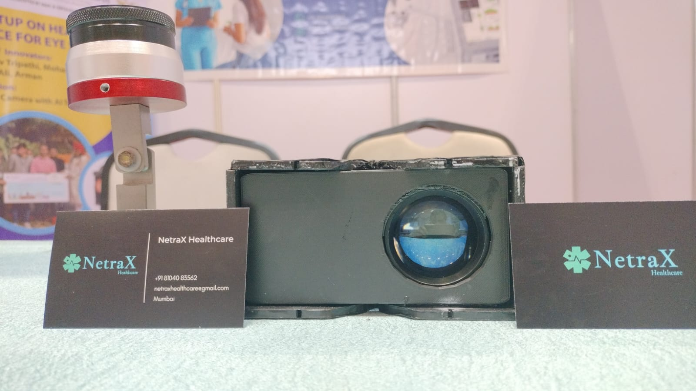

```
# Fundus Camera  

  

A portable and affordable **Fundus Camera** designed for capturing high-quality retinal images. This project is optimized for deployment in rural areas, providing essential tools for retinal disease detection and analysis.  

---

## Getting Started (For Desktop App)  

Follow these steps to set up the **Fundus Camera** desktop application on your system:  

### 1. Clone the Repository  
Clone the repository to your local machine:  
```sh  
git clone https://github.com/anubhavtripathi0509/FundusCamera  
```  

### 2. Change the Working Directory  
Navigate to the **Desktop-App** directory:  
```sh  
cd Desktop-App  
```  

### 3. Install Dependencies  
Install all the required packages:  
```sh  
npm install .  
```  

### 4. Add Machine Learning Models  
Place the necessary ML models into the `/src/backend/models` directory.  

### 5. Run the Application  
Start the application in development mode:  
```sh  
npm run dev  
```  

---

## Features  
- **Real-Time Retinal Imaging**: Captures high-resolution retina images.  
- **AI-Powered Analysis**: Supports integration of machine learning models for disease detection.  
- **User-Friendly Interface**: Easy-to-use desktop application for healthcare professionals.  
  

---  

For any questions or issues, please contact [anubhavtripathi0509@gmail.com](mailto:anubhavtripathi0509@gmail.com).  
``` 